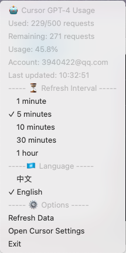

# CursorBar

A modern, cross-platform system tray application for monitoring Cursor AI usage metrics in real-time.

## 文档

[英文](/README.md) ｜ [中文](./README-zh_CN.md)

## Screenshot



## Features

- 🎯 **Real-time Monitoring**: Track your Cursor AI usage with live updates
- 🎨 **Visual Indicators**: Color-coded status icons based on usage levels
- 🌍 **Internationalization**: Full support for English and Chinese interfaces
- ⚡ **Customizable Refresh**: Configurable update intervals (1min to 1hour)
- 🔄 **Auto-refresh**: Background updates with configurable intervals
- 🛠 **Cross-platform**: Native support for macOS, Windows, and Linux
- 🎮 **Interactive Menu**: Quick access to settings and usage statistics
- 🔐 **Secure**: Local storage of settings with no cloud dependencies
- 🚀 **Performance**: Optimized with Rust for minimal resource usage
- 🛡️ **Reliability**: Robust error handling and graceful degradation

## Installation

Download the latest release for your platform from our [Releases page](https://github.com/atopx/CursorBar/releases/latest).

### Manual Build

```bash
# Clone the repository
git clone https://github.com/atopx/CursorBar.git
cd CursorBar

# Build the project
cargo build --release

# Run the application
./target/release/cursor_bar
```

### System Requirements

- **macOS**: 10.14+ (Mojave or later)
- **Windows**: Windows 10 or later
- **Linux**: Any modern distribution with system tray support
- **Cursor**: Must be installed and logged in

## Platform Support

| Platform | Tested | System Tray | Notes           |
| -------- | ------ | ----------- | --------------- |
| macOS    | ✅      | ✅           | Fully supported |
| Windows  | ⚠️      | ✅           | Needs testing   |
| Linux    | ⚠️      | ✅           | Needs testing   |

## Features in Detail

### Usage Monitoring
- Real-time display of used/total requests
- Usage percentage calculation with 0.1% precision
- Color-coded status indicators:
  - 🟢 Green: < 50% usage
  - 🟡 Yellow: 50-70% usage
  - 🟠 Orange: 70-90% usage
  - 🔴 Red: > 90% usage

### Menu Options
- **Usage Statistics**
  - Current usage count
  - Remaining requests
  - Usage percentage
  - Account email
  - Last update time

- **Settings**
  - Language selection (English/Chinese)
  - Refresh interval configuration (1min, 5min, 10min, 30min, 1hour)
  - Quick access to Cursor settings
  - Manual refresh option

### Technical Features
- Built with Rust for optimal performance and safety
- Minimal resource usage (~5MB RAM)
- Secure local storage with automatic backup
- Automatic error handling and retry mechanisms
- Graceful degradation on network issues
- Efficient memory management with parking_lot
- Non-blocking UI updates

## Configuration

The application automatically saves your preferences:
- Language selection
- Refresh interval
- Window position (if applicable)

Settings are stored in:
- **macOS**: `~/Library/Application Support/CursorBarWatch/settings.json`
- **Windows**: `%APPDATA%/CursorBarWatch/settings.json`
- **Linux**: `~/.config/CursorBarWatch/settings.json`

## Troubleshooting

### Common Issues

**Q: "Unable to obtain access token" Error**
- Ensure Cursor is installed and logged in
- Verify Cursor has been run at least once
- Check if Cursor is running in the background

**Q: Data Not Updating**
1. Click "Refresh" in the menu
2. Restart the application
3. Check your network connection
4. Verify Cursor is running and logged in

**Q: Application Won't Start**
- Check system requirements
- Ensure you have the correct binary for your platform
- Run from terminal to see error messages

**Q: High CPU Usage**
- Check refresh interval (default: 5 minutes)
- Restart the application
- Report the issue with system information

### Performance Optimization

The application is optimized for minimal resource usage:
- Efficient memory management with Arc and Mutex
- Smart caching to reduce API calls
- Optimized network requests with connection reuse
- Background updates with graceful shutdown
- Lazy loading of UI components

### Debug Mode

Run with debug logging:
```bash
RUST_LOG=debug ./cursor_bar
```

## Development

### Building from Source

```bash
# Install Rust (if not already installed)
curl --proto '=https' --tlsv1.2 -sSf https://sh.rustup.rs | sh

# Clone and build
git clone https://github.com/atopx/CursorBar.git
cd CursorBar
cargo build --release
```

### Dependencies

- **ureq**: HTTP client with JSON support
- **tray-icon**: Cross-platform system tray
- **tao**: Cross-platform window management
- **parking_lot**: High-performance synchronization
- **retry**: Robust retry mechanisms
- **serde**: Serialization framework
- **anyhow**: Error handling

## Contributing

Contributions are welcome! Please:

1. Fork the repository
2. Create a feature branch
3. Make your changes
4. Add tests if applicable
5. Submit a pull request

### Code Style

- Follow Rust standard formatting (`cargo fmt`)
- Run clippy for linting (`cargo clippy`)
- Ensure all tests pass (`cargo test`)

## License

This project is licensed under the [MIT License](LICENSE).

## Changelog

### v0.1.0 (Initial Release)
- Real-time Cursor usage monitoring
- Cross-platform system tray support
- Bilingual interface (English/Chinese)
- Configurable refresh intervals
- Robust error handling
- Performance optimizations
